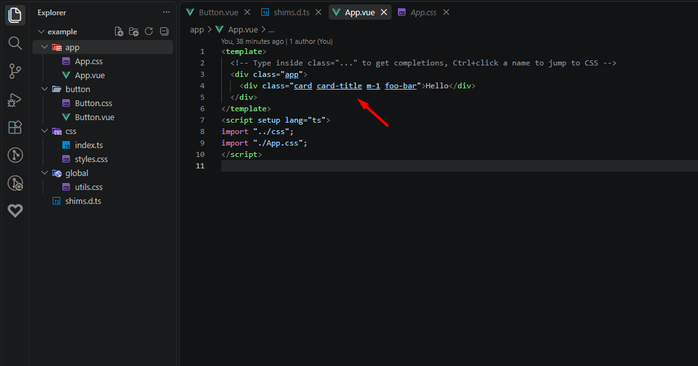

# Vue CSS Intellisense

A VSCode extension that provides CSS class completion, go-to-definition, hover info, and underlining in Vue files — based on the CSS files imported in `<script setup>` plus configurable global CSS.



## Features

- **Completion** — suggests class names inside `class`, `:class`, and `v-bind:class` attributes.
- **Go to definition** — Ctrl+click a class in `<template>` to jump to its CSS definition.
- **Hover** — shows which CSS files define a class.
- **Underline** — highlights class names that resolve to a known CSS file.
- **Deep resolution** — follows import chains such as `App.vue → import "../css" → css/index.ts → import "./styles.css"`, nested `.vue` files, and CSS `@import`s. Only `<script setup>` imports are considered; `<style scoped>` blocks are ignored.

## Settings

| Setting | Default | Description |
|---|---|---|
| `vueCss.globalCss` | `[]` | Global CSS resolvable in every Vue file. Absolute paths, workspace-relative paths (e.g. `src/assets/global.css`), or globs (e.g. `src/**/*.css`). |
| `vueCss.enableCompletion` | `true` | Class-name completions in Vue templates. |
| `vueCss.enableDefinition` | `true` | Go-to-definition for class names. |
| `vueCss.enableHover` | `true` | Hover info for class names. |
| `vueCss.enableUnderline` | `true` | Underline resolved class names. |
| `vueCss.maxCssFileSizeKb` | `1024` | CSS files larger than this are skipped. |
| `vueCss.maxCachedFiles` | `200` | Parsed CSS files kept in the LRU cache. |

Commands: `Vue CSS: Refresh class cache` (`vueCss.refreshCache`).

## Development

Requires [pnpm](https://pnpm.io) (pinned via the `packageManager` field, Node 22).

```sh
pnpm install
pnpm test      # vitest unit + benchmark tests
pnpm run lint  # typecheck
pnpm run compile  # bundle to out/main.js (dev, with sourcemap)
pnpm run package  # minified bundle + vscode-vue-css-*.vsix
```

Press `F5` in VSCode to launch the Extension Development Host with the `example/` folder open.

Pushes to `main` build the `.vsix` via GitHub Actions (`.github/workflows/build.yml`); the artifact is kept for 30 days.
